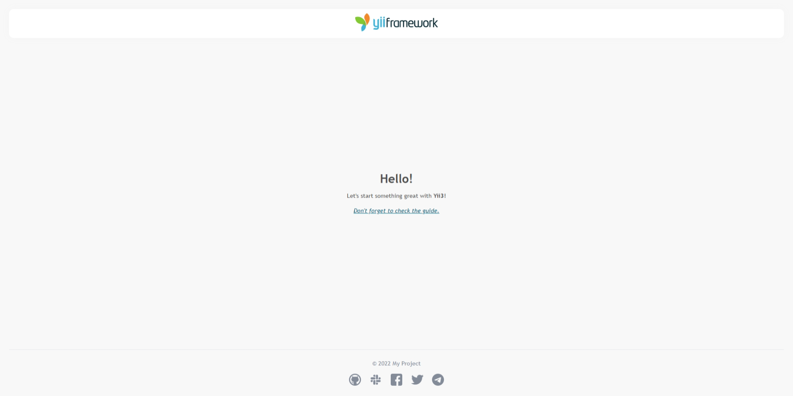

<p align="center">
    <a href="https://github.com/yii-tools/app" target="_blank">
        
    </a>
    <h1 align="center">Application template</h1>
    <h3 align="center">The best for rapidly creating projects.</h3>
    <br>
</p>

<p align="center">
    <a href="https://github.com/yii-tools/app" target="_blank">
        
    </a>
</p>

## Requirements

The minimum requirement by this project template that your Web server supports PHP 8.1.

## Installation

You'll need at least PHP 8.1.

If you do not have [Composer](http://getcomposer.org/), you may install it by following the instructions
at [getcomposer.org](http://getcomposer.org/doc/00-intro.md).

You can then install this project template using the following command:

```
composer create-project --prefer-dist --stability=dev yii-tools/app <your project>
```

In order to launch development web server run:

```
composer run serve
```

Now you should be able to access the application through the URL printed to console. Usually it is http://localhost:8080.

## Directory structure

The application template has the following structure directory:

```text
root
├── config                          Configuration files.
│   └── common                      Common configuration files.
│   └── web                         Web configuration files.
│   └── params.php                  Application parameters.
│   └── routes.php                  Application routes.
|   └── widgets.php                 Widgets configuration.
├── public                          Files publically accessible from the Internet.
│   └── assets                      Published assets.
│   └── index.php                   Entry script.
├── resources                       Application resources.
│   └── assets                      Custom assets.
│   └── messages                    Message translations.
│   └── layout                      Layout templates.
│   └── view                        View templates.
├── runtime                         Files generated during runtime.
├── src                             Application source code.
│    └── Asset                      Asset bundle definitions.
│    └── Command                    Console commands.
│    └── Controller                 Web controller classes.
│    └── Handler                    Handlers for events.
|    └── ApplicationParameters.php  Application parameters.
|    └── Installer.php              Installer.
```

## Configuration

If you want to customize your **app**, read the [docs](/docs/config.md).

## Checking dependencies

This package uses [composer-require-checker](https://github.com/maglnet/ComposerRequireChecker) to check if all dependencies are correctly defined in `composer.json`.

To run the checker, execute the following command:

```shell
./vendor/bin/composer-require-checker
```

## Static analysis

The code is statically analyzed with [Psalm](https://psalm.dev/). To run static analysis:

```shell
./vendor/bin/psalm
```

## Testing

The code is tested with [Codeception](https://codeception.com/). To run tests:

```
vendor/bin/codecept run
```

## CI status

[](https://github.com/yii-tools/app/actions)
[](https://codecov.io/gh/yii-tools/app)
[](https://github.com/yii-tools/app/actions?query=workflow%3A%22static+analysis%22)
[](https://shepherd.dev/github/yii-tools/app)
[](https://github.styleci.io/repos/584779096?branch=main)

## License

The MIT License (MIT). Please see [License File](LICENSE.md) for more information.

## Our social networks

[](https://twitter.com/Terabytesoftw)
